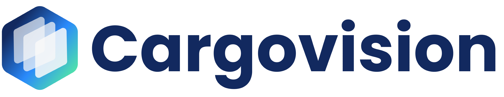

<p align="center">
  
  <h1 align="center">CargoVision AI</h1>
</p>


## 🔍 Overview

Cargovision AI is an advanced computer vision API designed for cargo inspection and analysis. It leverages deep learning models to detect dangerous goods, identify item types through segmentation, and perform OCR on container IDs in cargo images.

## ✨ Features

### 🛑 Dangerous Goods Detection
- Identifies hazardous materials and dangerous goods in cargo X-ray images
- Returns bounding box coordinates, class names, and confidence scores
- Provides visualization endpoints for annotated images

### 📦 Item Type Segmentation
- Segments different types of cargo items using instance segmentation
- Returns polygon coordinates, class names, and confidence scores
- Provides visualization endpoints with color-coded overlays

### 🔢 Container ID OCR
- Detects container ID regions in images
- Performs OCR to extract text from detected regions
- Returns structured data with detection boxes and extracted text

## 🛠️ Tech Stack

### Core Technologies
- **FastAPI**: Modern, high-performance web framework for building APIs
- **Ultralytics YOLOv8**: State-of-the-art object detection and segmentation models
- **EasyOCR**: Optical Character Recognition for text extraction
- **OpenCV**: Computer vision library for image processing
- **Pydantic**: Data validation and settings management
- **Uvicorn**: ASGI server for serving the FastAPI application

### Machine Learning Models
- **xray_cargo_dangerous_model.pt**: Detection model for dangerous goods
- **xray_cargo_items_model.pt**: Segmentation model for item types
- **container_id_model.pt**: Detection model for container ID regions

## 🚀 Installation

1. Clone the repository:
   ```bash
   git clone https://github.com/cargovision/cargovision-ai.git
   cd cargovision-ai
   ```

2. Create a virtual environment (optional but recommended):
   ```bash
   python -m venv venv
   source venv/bin/activate  # On Windows: venv\Scripts\activate
   ```

3. Install dependencies:
   ```bash
   pip install -r requirements.txt
   ```

4. Ensure model files are in the `models/` directory:
   - `models/xray_cargo_dangerous_model.pt`
   - `models/xray_cargo_items_model.pt`
   - `models/container_id_model.pt`

## 🏃‍♂️ Running the API

Start the API server:

```bash
uvicorn main:app --reload
```

The API will be available at http://localhost:8000

## 📚 API Documentation

Once the server is running, access the interactive API documentation at:
- Swagger UI: http://localhost:8000/docs
- ReDoc: http://localhost:8000/redoc

### API Endpoints

#### Health Check
- `GET /`: Check if the API is running and which models are loaded

#### JSON Inspection Endpoints
- `POST /inspect/dangerous-goods/`: Detect dangerous goods in an image
- `POST /inspect/item-types/`: Segment different item types in an image
- `POST /inspect/container-with-ocr/`: Detect container IDs and perform OCR

#### Visual Inspection Endpoints
- `POST /visualize/dangerous-goods/`: Return an image with dangerous goods highlighted
- `POST /visualize/item-types/`: Return an image with item types segmented
- `POST /visualize/container-with-ocr/`: Return an image with container IDs and OCR results

## 🐳 Docker Support

Build and run with Docker:

```bash
docker build -t cargovision-ai .
docker run -p 8000:8000 cargovision-ai
```

## 📋 Response Examples

### Dangerous Goods Detection

```json
{
  "filename": "cargo_image.jpg",
  "model_used": "dangerous_goods",
  "detections": [
    {
      "class_name": "Flammable",
      "confidence": 0.92,
      "box": {
        "x1": 100,
        "y1": 200,
        "x2": 300,
        "y2": 400
      }
    }
  ]
}
```

### Item Type Segmentation

```json
{
  "filename": "cargo_image.jpg",
  "model_used": "item_types",
  "detections": [
    {
      "class_name": "Electronics",
      "confidence": 0.88,
      "polygon": [
        {"x": 100, "y": 200},
        {"x": 300, "y": 200},
        {"x": 300, "y": 400},
        {"x": 100, "y": 400}
      ]
    }
  ]
}
```

### Container ID OCR

```json
{
  "filename": "container_image.jpg",
  "detections": [
    {
      "class_name": "ID",
      "confidence": 0.95,
      "box": {
        "x1": 100,
        "y1": 200,
        "x2": 300,
        "y2": 250
      },
      "ocr_text": "MSCU1234567"
    }
  ]
}
```

## 📝 License

This project is licensed under the MIT License - see the LICENSE file for details.